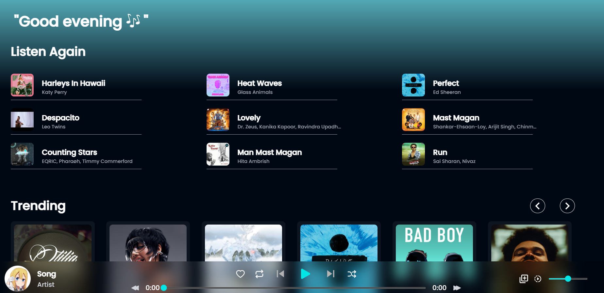
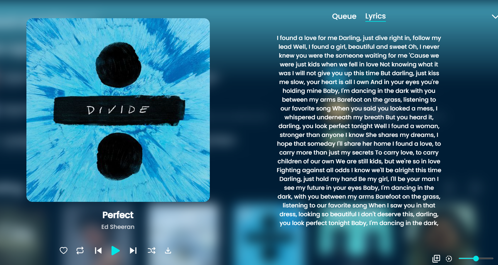
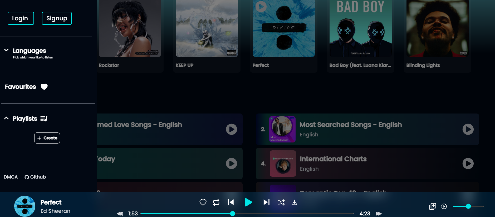

# [Project Name] 🎯

## Basic Details
### Team Name: [SyncSoul]

### Team Members
- Team Lead: Keerthana T P - College of Engineering Trivandrum
- Member 2: Kishlay Yadav - College of Engineering Trivandrum

### Project Description
A music player app with a twist..it allows you to appreciate the lyrics in a new way

### The Problem (that doesn't exist)
Are you tired of music overshadowing the poetic beauty of song lyrics? Do you find it hard to focus on the words while a catchy tune plays in the background? This app solves a problem that no one really had!

### The Solution (that nobody asked for)
Our solution? A music player that doesn’t play music! Instead, it offers a mesmerizing mechanical read-aloud of lyrics, like karaoke without the karaoke!

## Technical Details
### Technologies/Components Used
For Software:
- JavaScript, HTML, CSS
- NextJS
- SpeechSynthesis API
- Visual Studio Code, GitHub

### Implementation
For Software:
# Installation
git clone https://github.com/Kishlayyadavv/use-less
npm install

# Run
npm run dev

### Project Documentation
For Software:

## Screenshots

*This screenshot shows the main interface of the Music player app.*

*Here, users can select a song to have its lyrics read aloud.*

*This image illustrates the additional control features and functionalities.*

### Project Demo
# Video
[https://drive.google.com/file/d/1Xf_wpBGnFX-v5VhGJVk8ttNe1WqCTyqs/view?usp=drivesdk ]

## Team Contributions
- [Kishlay Yadav]: [Frontend development,API integration]
- [Keerthana T P]: [API integration,NextJS]

---
Made with ❤️ at TinkerHub Useless Projects 

